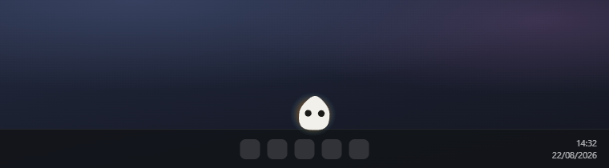
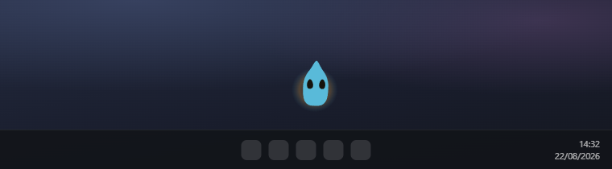
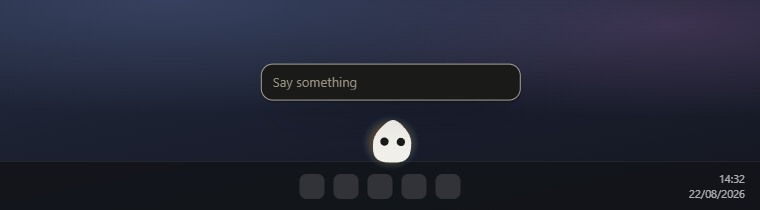
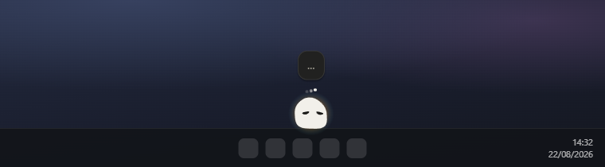
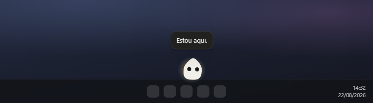

<div align="center">

# Haiky

**A small creature that lives over the Windows taskbar and keeps company while Claude Code works.**

The taskbar is its floor and the top of the screen is its ceiling. It walks the
bar, watches the pointer, falls asleep when you go away, and changes what it is
doing when Claude Code changes what *it* is doing. Right-click it and it talks
back; say nothing and it says nothing, forever.



</div>

---

> ## ⚠️ Terminated — not maintained
>
> **This project has stopped. It has no releases, and nobody is supporting it.**
> Issues and pull requests will not be answered.
>
> It did not stop because it was broken. It does what is described below, on
> Windows, and it is here because the parts that work are worth more to somebody
> than they are sitting on a disk: a creature with real physics that falls,
> lands and can be thrown; a click-through overlay that lets a window lie across
> your taskbar without eating a single click meant for Start; and a loopback
> bridge that turns Claude Code's hooks into something you can watch from the
> corner of your eye. Roughly 3,800 lines, with the reasoning behind every
> non-obvious decision written into the comments rather than lost.
>
> **You are welcome to take it and carry on.** Fork it, rename it, strip it for
> parts, or finish it. It is [MIT licensed](LICENSE) — no permission needed and
> no credit required. [CLAUDE.md](CLAUDE.md) says where everything lives and
> which rules are load-bearing; [IPC.md](IPC.md) documents the eleven channels
> across the preload that no static tool can see.
>
> [Known limits](#known-limits) is the honest account of what works, what is
> half-built, and what was about to change. The warm subprocess is the one that
> would be felt immediately.

---

# Part 1 — What it is

## One creature, and no window

There is no window. Everything is the tray icon, and everything you see is a
60px body standing on the top edge of your taskbar.

It has weight. It falls, it lands with a slap, and if you pick it up and throw
it at forty-five degrees it leaves at forty-five degrees and gravity takes it
from there. A walk is not a drawn arc — it is a small impulse, and the arc is
what gravity does with it. A throw is the same impulse, larger, from your hand
instead of from its legs.

**It never speaks unprompted.** No tips, no nudges, no "did you know". That is
not a setting you can turn on; no path in the renderer opens the bubble without
somebody having asked. It is the whole reason it is company rather than Clippy.

**It is not a coding assistant and must never become one.** There is a very good
one already on the screen.

**It never reads your code, your files or your transcript.** The creature is
told the mood, the run state, the open folders and where it is standing — not a
path, not a line, not a diff. That promise is kept by not sending them rather
than by asking nicely.

## It knows what Claude Code is doing

Five hooks post to a loopback server, and the creature wears the answer:

| what is happening | what you see |
| --- | --- |
| a Claude Code turn is running | attentive, halo at double, breath at three times the rate — **no dots** |
| it has stopped to ask you something | eyes wide, hops to the middle |
| **a turn has finished** | **bright blue, and a hop** |
| a turn failed | the worried face |
| you asked *it* something | the squint, and the three dots |



**The three dots are the creature's, not Claude Code's.** They used to mean a
turn was running, which was the wrong owner — three dots are the universal sign
for *I* am thinking, and lending them to somebody else's work says one thing
while meaning another.

**Blue is the one hue it never wears for a feeling of its own.** Red is anger,
yellow is delight, dark blue is disappointment, so a bright blue arriving down
there can only mean the app. It used to go yellow, which is also what it goes
when it is simply pleased — and a notification you cannot tell apart from a mood
is not a notification.

Three channels for one fact — colour, pose and a jump — because the whole job of
that state is to be noticed on a taskbar you are not looking at.

Haiky starts at login, sits invisible, and *appears* when a session file
appears. Watching for a file is a fact; watching for a process to be spawned is
a race.

## Ask it something

Left button picks it up, right button opens a box over its head.



Short imperatives about its own body — *dorme*, *salta*, *fica maior*,
*vai-te embora* — never leave the machine and cost nothing. Everything else goes
to Haiku: no preset, no tools, one turn, a structured reply.

| | |
| --- | --- |
| **while it thinks** | **when it answers** |
|  |  |

The squint and the dots are up only while a question of yours is in flight.
That is the whole of what they mean now.

`MASCOT.md` is not documentation about the prompt. It **is** the prompt. Editing
that file changes the creature and touches no code.

## Installing the hooks

Nothing arrives until Haiky is allowed to add five hooks to
`~/.claude/settings.json`. It asks, it shows you the exact JSON first, it backs
the file up into its own folder, and it can take them out again leaving the file
byte-identical.

**Hooks load when a session starts.** Installing them does nothing for the
sessions already open — a fact worth knowing before concluding they are broken.

## Keyboard and tray

| | |
| --- | --- |
| **left-click** the ink | pick it up and throw it |
| **right-click** the ink | ask it something |
| `Ctrl+Shift+H` | hide it, and bring it back |
| tray | install or remove the hooks, the lifetime spend, quit |

Only the drawn shape catches the pointer — never its 60px box, and never the
transparent sheet the window actually is.

---

# Part 2 — For developers

## Run it

```bash
npm install
npm start
```

That is the whole setup — no configuration, no services, no environment file.

`npm run dist` produces two things in `dist/`: an installer and a portable exe
that needs no install. Both are ~178MB, and almost all of that is one file.
`resources/claude/` is the whole Claude Code binary — 337MB before compression —
copied out of `node_modules` by `extraResources`, with the platform package
excluded from the asar, because a binary inside an asar is a binary nothing can
spawn. That path is exactly what `executable()` in `src/main/mascot.js` looks
for when `app.isPackaged`.

| Script | |
| ------ | --- |
| `npm start` | `electron .` |
| `npm run icon` | regenerate the app icon and both tray icons |
| `npm run shots` | regenerate the screenshots in `docs/images/` |
| `npm run pack` | unpacked win build, for looking at |
| `npm run dist` | the NSIS installer and the portable exe |
| `npm run graph` | rebuild the knowledge graph in `graphify-out/` |

## Stack

| Layer | Choice | Why |
| ----- | ------ | --- |
| Shell | Electron 43 | contextIsolation, one preload, no Node in the page |
| Voice | `@anthropic-ai/claude-agent-sdk` | Haiku, **no preset** — a plain string in `systemPrompt` replaces `claude_code` outright |
| Renderer | none | `src/renderer/` never `require`s anything |
| Icons | `tools/make-icon.js` | drawn from the same superellipse the engine uses, so no exported asset can drift |
| Screenshots | `tools/shoot.js` | the shipping renderer, loaded and photographed — see below |
| Packaging | electron-builder | NSIS + portable, x64 |
| Graph | graphify | `graphify-out/`, rebuilt by a post-commit hook |

One runtime dependency, and it is the model. Everything else is Electron.

The icon generator emits a pale creature for a dark taskbar and a dark one for a
light taskbar, picked at runtime from `nativeTheme` and followed live. Windows
does not invert a tray icon for you, and the first build shipped a black
creature on a black taskbar.

**The screenshots are generated too, and two things in them are not the app.**
`tools/shoot.js` loads `src/renderer/overlay.html` — the shipping renderer, its
own stylesheet, its own 1,532 lines — into an ordinary window, drives it
through the same surfaces main drives it through, and photographs it. The
creature, its shape, its colours, its physics and where every bubble lands are
therefore the real thing, at the real 60px. The **backdrop is drawn rather than
photographed**, because a picture of a real desktop puts whatever happened to
be open that afternoon into a public repository, and the **one sentence it
says was written rather than paid for**. Everything else in the frame is the
app answering for itself.

The stand-in bridge lives in `tools/shoot-preload.js` and answers the same
eleven channels. `src/renderer/mascot.js` guards every use of `window.haiky`
precisely so that it can be opened outside Electron and looked at; this is that
door, used by a camera.

## Layout

```
src/
  main/           the only process that may touch a disk
    main.js       orchestration, and ACT — the permission list
    overlay.js    the transparent window, and the 30Hz hit test
    sessions.js   watches ~/.claude/sessions/, checks every pid
    bridge.js     the loopback server the five hooks post to
    hooks.js      merges a block into ~/.claude/settings.json
    mascot.js     the voice — spawns claude.exe, one turn
    intents.js    the free regex router, asked first
    store.js      persistence, and the usage ledger
    geometry.js   display.bounds - display.workArea = the taskbar
    preload.js    the only bridge: eleven named channels
  renderer/       the creature — pose sampling, physics, drawing
IPC.md            what those eleven channels carry
MASCOT.md         the prompt, which is to say the character
tools/            source that is not shipped
  make-icon.js    the app icon and both tray icons
  shoot.js        the screenshots below, and the bridge they are driven through
docs/images/      those screenshots, regenerable
```

## The parts worth knowing

A handful of decisions look arbitrary until you know what went wrong without
them.

**`IPC.md` is not optional reading.** Import graphs cannot see channel names, so
the wire between `main.js`, `overlay.js` and `renderer/mascot.js` is invisible to
every static tool including this project's own knowledge graph. A channel that
is not in `IPC.md` is a channel nothing can find later.

**Facts go up, conclusions come down.** The hit test lives in main, not in the
page. It started in the page, which was right when the window was a 144px strip:
the worst a mistake could do was make a slice of taskbar unclickable. The window
is the whole screen now, so a test that says yes and never says no again would
leave every click landing on an invisible sheet of glass. The renderer publishes
where the ink is; main draws the conclusion, in the same loop that reads the
cursor, with no round trip that can be dropped or answered by a page that has
stopped painting.

**Electron's mouse forwarding does not reach this window.** The cause is
`focusable: false` — the window never becomes foreground, and forwarding never
fires for a window that is never active. So main polls `getCursorScreenPoint` at
30Hz and toggles `WS_EX_TRANSPARENT`. The same flag is why the ask box has to
lift focus on the way in and put it back on the way out, on blur as well as on
request: the two ways out of that box are Escape and clicking elsewhere, and
only one of them tells us.

**The run state arrives where the engine already looked.** The preload writes it
onto `body.dataset.run`, so the MutationObserver and every pose hanging off it
are untouched code. The creature cannot tell that the fact now arrives over IPC
from a hook rather than from a composer next door.

**`ACT` in `main.js` is the whole permission surface.** Every act is one narrow
function taking **no argument**. There is no shell, no path, no name that
reaches a filesystem, and a name that is not in that object does nothing. Read
it as the permission list and keep it that way — the moment one of them takes an
argument from the renderer, the guarantee is gone.

**Writing into `~/.claude/settings.json` has four rules**, each here because the
alternative is somebody losing work. Merge, never replace. Back up first, into
Haiky's own folder — a backup in `~/.claude/backups` would be litter in a
directory another program prunes. Write atomically, because a half-written
`settings.json` does not parse and Claude Code would open tomorrow having
forgotten everything. Remove exactly what was added, recognised by URL: an event
left empty loses its key, and a `hooks` left empty loses its key too.

**`async: true` on every hook is not a detail.** A hook Claude Code waits for is
a hook that makes Claude Code slower, and nothing about a mascot is worth a
millisecond of somebody's turn.

**Five events and no more.** `PreToolUse`/`PostToolUse` would mean a hundred
requests for a turn with fifty tool calls, to say something already known. They
are where "it is running tests" would come from later — a reason to add them
when there is something to do with them.

**Three guards keep the regex router from eating the conversation.** Nothing over
60 characters, nothing containing a question mark, and every pattern anchored at
both ends. *"não durmas"* and *"dorme"* are one character apart in a substring
search and opposite in meaning. A router that is too eager turns a creature with
a personality into a vending machine.

**Session files outlive their processes.** This machine had sixty-two files and
five live sessions, so every pid is checked before it counts.

**Never bump a `version` in `store.js` `DOCS` casually.** `load()` falls back to
defaults on a version mismatch, so a bump discards that document — for `usage`,
that is the user's whole spend history.

## Where the creature came from

The creature is not original to this app. Its engine was lifted whole out of an
earlier, unrelated project and re-pointed: `src/renderer/mascot.js` **is** that
file. The geometry, the poses, the gaze, the eyes, the blink and the sleep are
unchanged, because they were right and because the numbers in them were arrived
at by doing the other thing first — which is the reason to leave them alone
rather than tune them.

What changed is only where it lives, and it changed in five places, each
commented where it happens and numbered `CHANGE n OF 5`; a sixth replaced the
drawn gait with physics. Where it came from, the creature stood inside a window
and read the host app's own DOM for everything — the caret, the streaming
answer, its perches, and the acts, which were that app's own buttons. There is
no page here, so each of those was re-pointed at the desktop instead.

One thing was fixed rather than carried across: the original closed its `<svg>`
twice. The parser dropped the orphan and it always worked, and the fault had
been left in place deliberately so that fixing it would be a decision somebody
made rather than one that happened to them. This is that decision.

## What was measured

There is no test suite. There are measurements, and they are why the numbers in
this file are numbers rather than adjectives.

**That the hooks arrive is evidence, not inference.** A bare listener was put on
the port in Haiky's place and a fresh headless session run against the real
settings file:

```
  8019ms  POST /haiky/working  token=sim  event=UserPromptSubmit  session=d43c119f  cwd=Haiky
 11159ms  POST /haiky/done     token=sim  event=Stop             session=d43c119f  cwd=Haiky
 11182ms  POST /haiky/end      token=sim  event=SessionEnd       session=d43c119f  cwd=Haiky
```

Header present, one session id across all three, right working directory.
`Notification` and `StopFailure` are conditional and did not fire in a trivial
run, which is correct. The installer was verified against a copy of a real 4KB
hand-edited settings file: install then remove returns it identical, another
program's hooks in the same events survive both, reinstalling on a different
port leaves no duplicates, and a `settings.json` that will not parse is refused
rather than replaced.

**Mouse forwarding was ruled out, not guessed at.** A sweep of six hundred
cursor positions produced not one `pointermove` in the page.

**Weight is acceleration relative to size.** `G` is about eight times real
gravity at this scale, because a 60px body falling at 9.8m/s² reads as a
feather. Dropping from three heights:

| drop | peak squash | width |
| --- | --- | --- |
| 90px | 0.33 | 38 → 41px |
| 430px | 0.73 | 38 → 52px |
| ceiling | 0.99 | 38 → 60px |

Slime is drawn out and narrowed by the speed of a fall, flattened and spread by
the blow that ends it, both roughly preserving area — a thing that only
stretched would look like it was being scaled, which is exactly what it is and
exactly what it must not look like. Everything scales about the **heel** rather
than the middle, which is the difference between squashing on the floor and
sinking into it. The stretch is held back while the squash recovers
(`× (1 - sq)`), and that is a fix rather than a refinement: a landing hard
enough to bounce hands the creature its upward velocity on the very frame the
squash is set, so the two cancelled. Before the fix the widest frame of a bounce
measured 36px against a resting 35 — the number was right and nothing was
visible.

A throw at forty-five degrees, logged: released at `vx -1340, vy -1203` (42°),
apex 641px up, bounced off the left wall (`vx` −1027 → +539), two floor bounces,
then rolled to a stop.

**The voice costs more than hoped.**

| | latency | in | out | cost |
| --- | --- | --- | --- | --- |
| script | ~0ms | — | — | $0 |
| first model reply | ~10s | 6392 | 268 | $0.0254 |
| second | 5.7s | 6450 | 188 | $0.0115 |

The regex router, measured end to end: typed, Enter, and **166ms later it was
already in the air**.

Caching roughly halves the model path after the first reply — the character file
sits before `SYSTEM_PROMPT_DYNAMIC_BOUNDARY` and the name and memories after it,
so the long unchanging half is cacheable and the short changing half is not.
(Measured rather than assumed: replacing the whole character file with one line
dropped the token count to 3,617 and put the cost **up**. The file is cheap for
being long and unchanging; what costs money is a system prompt that varies.)

A cent a sentence and six seconds is not good enough. The latency is a
`claude.exe` spawned per message, and keeping one warm across messages is the
fix. Until it is written, the script table is what makes the creature feel
alive, and the model is for the half a table of regexes is no good at — which is
everything with a person in it.

## Known limits

- **A warm subprocess is not written yet.** Every model reply spawns a
  `claude.exe` and waits for it, which is most of the six seconds.
- **The weekly ledger never rolls over.** `usage.week` is written on every reply
  and read by nothing. `mascot.rollWeek()` is the thing that would clear it, and
  it has no caller — the app this was ported from had a host that called it
  with the reset stamp the account reported, and Haiky, which spawns
  `claude.exe` itself, has no such stamp to read. The lifetime figure in the tray is the honest one; the week
  beside it in the document is not a week. Left in place rather than removed
  because clearing it means bumping the document version, and a version bump
  throws the lifetime total away with it.
- A genuinely full-screen app covers the overlay. That is correct.
  `Ctrl+Shift+H` hides it and brings it back, and the tray no longer carries
  that switch: a second word for Quit that left the app running invisibly was
  being misread, so if you do not want it, close it. The shortcut can fail to
  register when something else already holds the combination — launching Haiky
  again is the way back from a hidden creature, since the second instance hands
  the first one *on* and exits.
- An auto-hidden taskbar reports no rectangle to subtract, so the creature
  stands where the bar will be when it slides back up.
- The primary display only, for now.
- Where you put it down does not survive a restart.
- **Skins, sounds and a settings window** do not exist. The tray carries the
  switches that do.
- **Changing the Claude Desktop theme** is not something it will do. That theme
  lives in a leveldb store and is not safely writable from outside.
  `~/.claude/settings.json` is; the desktop app's appearance is not, and the
  creature should say so rather than pretend.
- Windows only. Nothing about the taskbar geometry or `WS_EX_TRANSPARENT` has
  been written for anywhere else.

---

## License

[MIT](LICENSE). Copyright © 2026 Tomas Girao.

The project is terminated, and the licence is what makes *somebody else should
take this* an offer rather than a sentiment. Do what you like with it. No
credit is asked for — MIT's one formality is that the notice above travels with
the copy, and that is the whole of what is owed. Expect no warranty and no
support.
